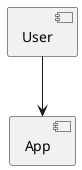

# Create Agents


If there isn’t an agent that helps with your needs, create one! Creating an agent is simple, and once it works and helps you, share it so your team and the Tero community can benefit too.

While you create or edit an agent, every change is saved automatically and you can try your changes right away in the chat on the right.

## Clone

One of the easiest ways to create an agent is to clone an existing one. This lets you adapt an agent to your context (project, preferences, way of working), or create similar agents reusing existing ones as templates.

You can clone an agent from the agent detail dialog in [Explore agents](./discover.md) or from any chat with that agent.

## Basic Info

When you create an agent, choose a good icon, name, and description. This helps quickly identify it among other agents.

Names and descriptions are purposely short in Tero to support quick scanning and selection. Think of the user and be succinct so the agent’s purpose is clear.

::: tip Auto-generate
Tero can auto-generate the name, description, and system prompt from the other fields. If you’ve set some fields, use the magic wand to generate or refine the rest. It’s handy for starting values or quick adjustments.
:::

## Model

Tero supports a growing variety of LLM models you can use as the basis for your agent. The model is like the agent’s brain: it analyzes each user request, plans how to answer using the configured tools, and either generates an answer or invokes tools as needed.

Available models in your Tero instance depend on how it’s configured. Currently Tero supports models from OpenAI (GPT), Azure OpenAI (GPT), AWS Bedrock (Claude), and Google (Gemini). The community continues to expand this list.

::: tip Cheaper & faster first
When creating an agent, start with cheaper and faster models. They’re easier to use and help you, and others, avoid unnecessary budget spend (in general more powerful = more expensive).
:::

::: tip Experiment
Different models excel at different tasks (e.g., Claude often shines for code; GPT can be great for brainstorming or writing). Experiment, and don’t assume a new version of a model behaves like the previous one.
:::

Depending on the model type, you may also set Temperature or Reasoning level.

### Temperature

Temperature controls how much the agent’s answers vary. For more creative outputs (e.g., brainstorming), choose Creative. For more consistent, precise answers with less variation, choose Precise. Use Neutral for a balanced behavior.

### Reasoning Level

Reasoning level defines how much the agent analyzes before answering. More reasoning usually means better results but slower responses. Use High for complex tasks, Low for simple tasks, and Medium for relatively simple ones.

## Instructions

The instructions (aka system prompt) define how your agent responds to user requests. A good system prompt usually includes a role the agent should assume, the main tasks it solves, formatting expectations for answers, and optionally examples of inputs and outputs.

::: tip Short and simple
Prefer short, simple prompts. The bigger the prompt, the harder it is to follow by the agent and for you to maintain.
:::

::: tip Agent to tune system prompt
Use an agent to help you improve your system prompt. You can use the [Agents from Scratch](https://github.com/abstracta/tero-agents/blob/main/en/agents-from-scratch/agent.md) agent if you need help to start from scratch.
:::

::: tip Divide & Conquer
Avoid “do everything” agents. Focus each agent on a specific task and create multiple agents for different needs. It keeps instructions short, answers better, reduces budget by limiting context, and makes it easier for users to discover the right agent.

In future versions of Tero, we plan to make it easier to combine agents to solve a task, so don’t worry about copy/pasting between chats—we’ll have a better solution soon 😉.
:::

::: tip Optimize
Start simple, then optimize. Review the [Thought Process](./chat.md#thought-process) to see how the agent solves requests and add step-by-step guidance to the prompt for recurring tasks. This makes answers faster, more predictable, and reduces budget usage. With detailed instructions, you can often use cheaper & faster models too.
:::

::: tip Markdown
Ask the agent to format answers in Markdown. You’ll get cleaner results (headings, lists, tables, code blocks, etc.).
:::

::: tip PlantUML
If you need UML or general diagrams, ask the agent to use [PlantUML](https://plantuml.com/).

When doing so, instruct the agent not to wrap diagrams in code blocks so they render properly.

Example — this generates only the text of the diagram:

````

````

And this renders a diagram image:

````
@startuml
[User] --> [App]
@enduml
````
:::

::: tip ECharts
You can also ask the agent to present information using charts with [ECharts](https://echarts.apache.org/en/index.html).
:::

## Conversation Starters

When you create an agent, consider adding [Conversation starters](./chat.md#conversation-starters). They help new users understand what the agent can do and get going quickly.

## Tools

Tools extend what your agents can do. Below is the list of currently supported tools. Expect it to grow as the community contributes new ones.

:::: tip Keep it lean
Enable only the tools your agent truly needs. Fewer tools makes the agent faster, cheaper, and more predictable.
::::

@include: ./tools/index.md

## Tests


Tero focuses on software quality, and quality requires tests. Add tests to ensure your agents behave as intended.

Tests let creators and editors experiment safely. Define a test suite for your agent by specifying user inputs and example expected outputs. Then you can change models, prompts, tools, etc., and verify, by running the test suite, that your core use cases still work.

## Publish

When your agent starts being useful to you, share it with your team so others can benefit too!

You can share it with any private team (only your teammates can use it), or with the Global team (all users in your Tero instance can discover and use it).

When you share an agent with a team, the team leaders can edit the agent if they need to improve it. You’ll still be able to edit it, and you’ll remain listed as the author.

## Export & Import

You can move agents (or their updates) between Tero environments by exporting and importing them.

Furthermore, you can import any agents contributed by the community from the [public repository of agents](https://github.com/abstracta/tero-agents).

Be part of the Tero community: contribute your agents so everyone benefits! Export your agent and submit a Pull Request to the repository.
